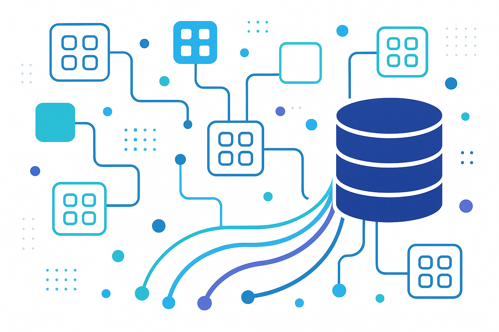

# Microsserviços de API de Dados em Go / Go Data API Microservices



## 🖼️ Imagem Hero


## 🇧🇷 Português

Um sistema de microsserviços de alta performance para APIs de dados, construído com Go, fornecendo capacidades robustas de processamento, análise e visualização de dados.

### 🚀 Funcionalidades

- **API RESTful**: Design de API limpo e consistente seguindo os princípios REST
- **Arquitetura de Microsserviços**: Serviços modulares para escalabilidade e resiliência
- **Processamento de Dados**: Poderosas capacidades de consulta, transformação e agregação
- **Análise**: Análise estatística, correlação, séries temporais e previsão
- **Autenticação e Autorização**: Autenticação segura baseada em JWT
- **Documentação**: Documentação Swagger/OpenAPI gerada automaticamente
- **Monitoramento**: Métricas Prometheus e log estruturado
- **Containerização**: Pronto para Docker e Kubernetes

### 📋 Sumário

- [Arquitetura](#arquitetura)
- [Serviços](#serviços)
- [Instalação](#instalação)
- [Uso](#uso)
- [Referência da API](#referência-da-api)
- [Desenvolvimento](#desenvolvimento)
- [Testes](#testes)
- [Implantação](#implantação)
- [Contribuindo](#contribuindo)
- [Licença](#licença)

### 🏗️ Arquitetura

O sistema segue uma arquitetura de microsserviços com os seguintes componentes:

- **API Gateway**: Ponto de entrada para todas as requisições do cliente, lida com roteamento e autenticação
- **Serviço de Dados**: Serviço principal para armazenamento, recuperação e manipulação de dados
- **Serviço de Autenticação**: Lida com a autenticação e autorização do usuário
- **Serviço de Análise**: Fornece capacidades de análise e visualização de dados

Cada serviço é implantável independentemente e se comunica via gRPC para comunicação interna e REST para clientes externos.

### 🧩 Serviços

#### API Gateway

O API Gateway serve como ponto de entrada para todas as requisições do cliente. Ele lida com:

- Roteamento de requisições para os serviços apropriados
- Autenticação e autorização
- Limitação de taxa e controle de fluxo
- Transformação de requisição/resposta
- Documentação da API (Swagger)

#### Serviço de Dados

O Serviço de Dados gerencia as operações de dados:

- Operações CRUD de conjuntos de dados
- Consulta de dados com filtragem, ordenação e paginação
- Transformação e agregação de dados
- Importação/exportação de dados em vários formatos (CSV, JSON, Parquet)

#### Serviço de Autenticação

O Serviço de Autenticação lida com o gerenciamento de usuários e segurança:

- Registro e autenticação de usuários
- Geração e validação de tokens JWT
- Controle de acesso baseado em função
- Gerenciamento de senhas e segurança

#### Serviço de Análise

O Serviço de Análise fornece capacidades de análise de dados:

- Análise estatística (média, mediana, desvio padrão, etc.)
- Análise de correlação
- Análise de séries temporais
- Previsão e predição

### 📦 Instalação

#### Pré-requisitos

- Go 1.18 ou superior
- PostgreSQL 13 ou superior
- Docker (opcional)
- Kubernetes (opcional)

#### Do Código Fonte

```bash
# Clone o repositório
git clone https://github.com/galafis/go-data-api-microservices.git
cd go-data-api-microservices

# Instale as dependências
go mod download

# Compile os serviços
make build

# Execute os serviços
make run
```

#### Usando Docker

```bash
# Construa as imagens Docker
docker-compose build

# Execute os serviços
docker-compose up -d
```

#### Usando Kubernetes

```bash
# Aplique os manifestos do Kubernetes
kubectl apply -f deployments/kubernetes/
```

### 🔧 Uso

#### Iniciando os Serviços

```bash
# Inicie todos os serviços
make run

# Inicie um serviço específico
make run-api-gateway
make run-data-service
make run-auth-service
make run-analytics-service
```

#### Variáveis de Ambiente

Crie um arquivo `.env` no diretório raiz com as seguintes variáveis:

```
# Servidor
ENVIRONMENT=development
SERVER_PORT=8080

# Banco de Dados
DB_DRIVER=postgres
DB_HOST=localhost
DB_PORT=5432
DB_USERNAME=postgres
DB_PASSWORD=postgres
DB_NAME=data_api
DB_SSL_MODE=disable

# Autenticação
JWT_SECRET=your-secret-key
ACCESS_TOKEN_EXPIRY=15m
REFRESH_TOKEN_EXPIRY=7d
PASSWORD_HASH_COST=10

# Log
LOG_LEVEL=info
LOG_FORMAT=json
LOG_OUTPUT=stdout
```

### 📚 Referência da API

A documentação da API está disponível em `/swagger/index.html` quando o API Gateway estiver em execução.

#### Autenticação

```
POST /api/v1/auth/register
POST /api/v1/auth/login
POST /api/v1/auth/refresh
POST /api/v1/auth/logout
```

#### Conjuntos de Dados

```
GET /api/v1/data/datasets
POST /api/v1/data/datasets
GET /api/v1/data/datasets/{id}
PUT /api/v1/data/datasets/{id}
DELETE /api/v1/data/datasets/{id}
```

#### Operações de Dados

```
POST /api/v1/data/query
POST /api/v1/data/transform
POST /api/v1/data/aggregate
POST /api/v1/data/join
```

#### Análise

```
GET /api/v1/analytics/summary
POST /api/v1/analytics/statistics
POST /api/v1/analytics/correlation
POST /api/v1/analytics/timeseries
POST /api/v1/analytics/forecast
```

#### Usuários

```
GET /api/v1/users/me
PUT /api/v1/users/me
DELETE /api/v1/users/me
```

### 💻 Desenvolvimento

#### Estrutura do Projeto

```
.
├── cmd/                    # Pontos de entrada dos serviços
│   ├── api-gateway/        # Serviço API Gateway
│   ├── data-service/       # Serviço de dados
│   ├── auth-service/       # Serviço de autenticação
│   └── analytics-service/  # Serviço de análise
├── internal/               # Pacotes internos
│   ├── auth/               # Lógica de autenticação
│   ├── config/             # Configuração
│   ├── database/           # Conexões de banco de dados
│   ├── handlers/           # Handlers HTTP
│   ├── middleware/         # Middleware HTTP
│   └── models/             # Modelos de dados
├── pkg/                    # Pacotes públicos
│   ├── logger/             # Utilitários de log
│   ├── validator/          # Utilitários de validação
│   └── utils/              # Utilitários gerais
├── api/                    # Definições de API
│   └── v1/                 # API v1
├── deployments/            # Configurações de implantação
│   ├── docker/             # Configurações Docker
│   └── kubernetes/         # Manifestos Kubernetes
├── docs/                   # Documentação
├── scripts/                # Scripts
├── .env.example            # Exemplo de variáveis de ambiente
├── Dockerfile              # Dockerfile
├── docker-compose.yml      # Configuração Docker Compose
├── go.mod                  # Módulos Go
├── go.sum                  # Checksums dos módulos Go
├── Makefile                # Makefile
└── README.md               # README
```

#### Fluxo de Desenvolvimento

1. Faça um fork do repositório
2. Crie uma branch de funcionalidade (`git checkout -b feature/minha-funcionalidade-incrivel`)
3. Faça suas alterações
4. Execute os testes (`make test`)
5. Faça commit de suas alterações (`git commit -m 'Adiciona uma funcionalidade incrível'`)
6. Envie para a branch (`git push origin feature/minha-funcionalidade-incrivel`)
7. Abra um Pull Request

### 🧪 Testes

#### Executando Testes

```bash
# Execute todos os testes
make test

# Execute testes com cobertura
make test-coverage

# Execute testes para um pacote específico
go test -v ./internal/auth/...
```

#### Benchmarks

```bash
# Execute os benchmarks
make benchmark
```

### 🚢 Implantação

#### Docker

```bash
# Construa as imagens Docker
docker-compose build

# Execute os serviços
docker-compose up -d
```

#### Kubernetes

```bash
# Aplique os manifestos do Kubernetes
kubectl apply -f deployments/kubernetes/
```

### 👥 Contribuindo

Contribuições são bem-vindas! Sinta-se à vontade para enviar um Pull Request.

1. Faça um fork do repositório
2. Crie sua branch de funcionalidade (`git checkout -b feature/minha-funcionalidade-incrivel`)
3. Faça commit de suas alterações (`git commit -m 'Adiciona uma funcionalidade incrível'`)
4. Envie para a branch (`git push origin feature/minha-funcionalidade-incrivel`)
5. Abra um Pull Request

### 📄 Licença

Este projeto está licenciado sob a Licença MIT - veja o arquivo LICENSE para detalhes.

---

## 🇬🇧 English

A high-performance microservices system for data APIs, built with Go, providing robust data processing, analysis, and visualization capabilities.

### 🚀 Features

- **RESTful API**: Clean and consistent API design following REST principles
- **Microservices Architecture**: Modular services for scalability and resilience
- **Data Processing**: Powerful query, transform, and aggregation capabilities
- **Analytics**: Statistical analysis, correlation, time series, and forecasting
- **Authentication & Authorization**: Secure JWT-based authentication
- **Documentation**: Auto-generated Swagger/OpenAPI documentation
- **Monitoring**: Prometheus metrics and structured logging
- **Containerization**: Docker and Kubernetes ready

### 📋 Table of Contents

- [Architecture](#architecture)
- [Services](#services)
- [Installation](#installation)
- [Usage](#usage)
- [API Reference](#api-reference)
- [Development](#development)
- [Testing](#testing)
- [Deployment](#deployment)
- [Contributing](#contributing)
- [License](#license)

### 🏗️ Architecture

The system follows a microservices architecture with the following components:

- **API Gateway**: Entry point for all client requests, handles routing and authentication
- **Data Service**: Core service for data storage, retrieval, and manipulation
- **Auth Service**: Handles user authentication and authorization
- **Analytics Service**: Provides data analysis and visualization capabilities

Each service is independently deployable and communicates via gRPC for internal communication and REST for external clients.

### 🧩 Services

#### API Gateway

The API Gateway serves as the entry point for all client requests. It handles:

- Request routing to appropriate services
- Authentication and authorization
- Rate limiting and throttling
- Request/response transformation
- API documentation (Swagger)

#### Data Service

The Data Service manages data operations:

- Dataset CRUD operations
- Data querying with filtering, sorting, and pagination
- Data transformation and aggregation
- Data import/export in various formats (CSV, JSON, Parquet)

#### Auth Service

The Auth Service handles user management and security:

- User registration and authentication
- JWT token generation and validation
- Role-based access control
- Password management and security

#### Analytics Service

The Analytics Service provides data analysis capabilities:

- Statistical analysis (mean, median, standard deviation, etc.)
- Correlation analysis
- Time series analysis
- Forecasting and prediction

### 📦 Installation

#### Prerequisites

- Go 1.18 or higher
- PostgreSQL 13 or higher
- Docker (optional)
- Kubernetes (optional)

#### From Source

```bash
# Clone the repository
git clone https://github.com/galafis/go-data-api-microservices.git
cd go-data-api-microservices

# Install dependencies
go mod download

# Build the services
make build

# Run the services
make run
```

#### Using Docker

```bash
# Build Docker images
docker-compose build

# Run the services
docker-compose up -d
```

#### Using Kubernetes

```bash
# Apply Kubernetes manifests
kubectl apply -f deployments/kubernetes/
```

### 🔧 Usage

#### Starting the Services

```bash
# Start all services
make run

# Start a specific service
make run-api-gateway
make run-data-service
make run-auth-service
make run-analytics-service
```

#### Environment Variables

Create a `.env` file in the root directory with the following variables:

```
# Server
ENVIRONMENT=development
SERVER_PORT=8080

# Database
DB_DRIVER=postgres
DB_HOST=localhost
DB_PORT=5432
DB_USERNAME=postgres
DB_PASSWORD=postgres
DB_NAME=data_api
DB_SSL_MODE=disable

# Authentication
JWT_SECRET=your-secret-key
ACCESS_TOKEN_EXPIRY=15m
REFRESH_TOKEN_EXPIRY=7d
PASSWORD_HASH_COST=10

# Logging
LOG_LEVEL=info
LOG_FORMAT=json
LOG_OUTPUT=stdout
```

### 📚 API Reference

The API documentation is available at `/swagger/index.html` when the API Gateway is running.

#### Authentication

```
POST /api/v1/auth/register
POST /api/v1/auth/login
POST /api/v1/auth/refresh
POST /api/v1/auth/logout
```

#### Datasets

```
GET /api/v1/data/datasets
POST /api/v1/data/datasets
GET /api/v1/data/datasets/{id}
PUT /api/v1/data/datasets/{id}
DELETE /api/v1/data/datasets/{id}
```

#### Data Operations

```
POST /api/v1/data/query
POST /api/v1/data/transform
POST /api/v1/data/aggregate
POST /api/v1/data/join
```

#### Analytics

```
GET /api/v1/analytics/summary
POST /api/v1/analytics/statistics
POST /api/v1/analytics/correlation
POST /api/v1/analytics/timeseries
POST /api/v1/analytics/forecast
```

#### Users

```
GET /api/v1/users/me
PUT /api/v1/users/me
DELETE /api/v1/users/me
```

### 💻 Development

#### Project Structure

```
.
├── cmd/                    # Service entry points
│   ├── api-gateway/        # API Gateway service
│   ├── data-service/       # Data service
│   ├── auth-service/       # Auth service
│   └── analytics-service/  # Analytics service
├── internal/               # Internal packages
│   ├── auth/               # Authentication logic
│   ├── config/             # Configuration
│   ├── database/           # Database connections
│   ├── handlers/           # HTTP handlers
│   ├── middleware/         # HTTP middleware
│   └── models/             # Data models
├── pkg/                    # Public packages
│   ├── logger/             # Logging utilities
│   ├── validator/          # Validation utilities
│   └── utils/              # General utilities
├── api/                    # API definitions
│   └── v1/                 # API v1
├── deployments/            # Deployment configurations
│   ├── docker/             # Docker configurations
│   └── kubernetes/         # Kubernetes manifests
├── docs/                   # Documentation
├── scripts/                # Scripts
├── .env.example            # Example environment variables
├── Dockerfile              # Dockerfile
├── docker-compose.yml      # Docker Compose configuration
├── go.mod                  # Go modules
├── go.sum                  # Go modules checksums
├── Makefile                # Makefile
└── README.md               # README
```

#### Development Workflow

1. Fork the repository
2. Create a feature branch (`git checkout -b feature/amazing-feature`)
3. Make your changes
4. Run tests (`make test`)
5. Commit your changes (`git commit -m 'Add some amazing feature'`)
6. Push to the branch (`git push origin feature/amazing-feature`)
7. Open a Pull Request

### 🧪 Testing

#### Running Tests

```bash
# Run all tests
make test

# Run tests with coverage
make test-coverage

# Run tests for a specific package
go test -v ./internal/auth/...
```

#### Benchmarks

```bash
# Run benchmarks
make benchmark
```

### 🚢 Deployment

#### Docker

```bash
# Build Docker images
docker-compose build

# Run the services
docker-compose up -d
```

#### Kubernetes

```bash
# Apply Kubernetes manifests
kubectl apply -f deployments/kubernetes/
```

### 👥 Contributing

Contributions are welcome! Please feel free to submit a Pull Request.

1. Fork the repository
2. Create your feature branch (`git checkout -b feature/amazing-feature`)
3. Commit your changes (`git commit -m 'Add some amazing feature'`)
4. Push to the branch (`git push origin feature/amazing-feature`)
5. Open a Pull Request

### 📄 License

This project is licensed under the MIT License - see the LICENSE file for details.

---

Created by Gabriel Demetrios Lafis


Created by Gabriel Demetrios Lafis


