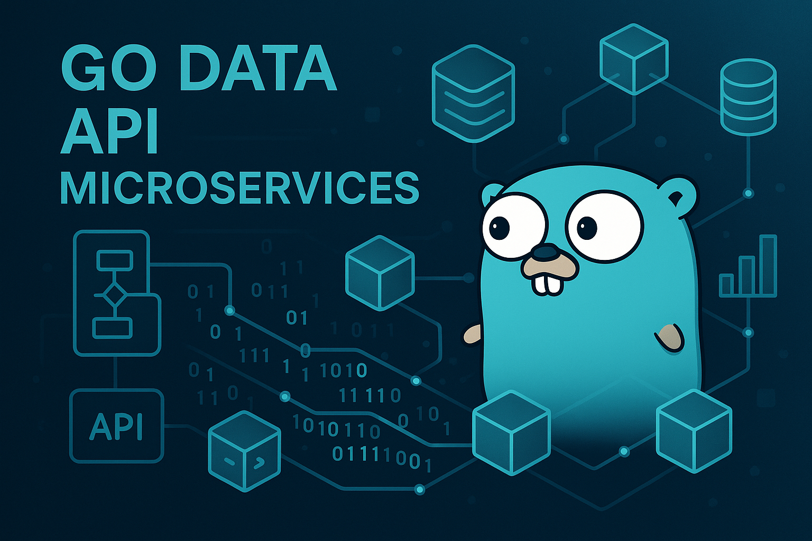

# Microsserviços de API de Dados em Go / Go Data API Microservices




## 🇧🇷 Português

Um sistema de microsserviços de alta performance para APIs de dados, construído com Go, fornecendo capacidades robustas de processamento, análise e visualização de dados.

Para a documentação completa em português, consulte [README.pt-br.md](docs/README.pt-br.md).

## 🇬🇧 English

A high-performance microservices system for data APIs, built with Go, providing robust data processing, analysis, and visualization capabilities.

For complete documentation in English, please refer to [README.en-us.md](docs/README.en-us.md).

## 📋 Estrutura do Projeto / Project Structure

```
.
├── src/                      # Código fonte dos serviços
│   ├── cmd/                    # Pontos de entrada dos serviços
│   │   ├── analytics-service/  # Serviço de análise
│   │   ├── api-gateway/        # Serviço API Gateway
│   │   ├── auth-service/       # Serviço de autenticação
│   │   └── data-service/       # Serviço de dados
│   ├── internal/               # Pacotes internos
│   │   ├── auth/               # Lógica de autenticação
│   │   ├── config/             # Configuração
│   │   ├── database/           # Conexões de banco de dados
│   │   ├── handlers/           # Handlers HTTP
│   │   ├── middleware/         # Middleware HTTP
│   │   └── models/             # Modelos de dados
│   ├── pkg/                    # Pacotes públicos
│   │   ├── logger/             # Utilitários de log
│   │   ├── validator/          # Utilitários de validação
│   │   └── utils/              # Utilitários gerais
│   ├── api/                    # Definições de API
│   │   └── v1/                 # API v1
│   ├── deployments/            # Configurações de implantação
│   │   ├── docker/             # Configurações Docker
│   │   └── kubernetes/         # Manifestos Kubernetes
│   ├── scripts/                # Scripts
│   ├── .env.example            # Exemplo de variáveis de ambiente
│   ├── Dockerfile              # Dockerfile
│   ├── docker-compose.yml      # Configuração Docker Compose
│   ├── go.mod                  # Módulos Go
│   ├── go.sum                  # Checksums dos módulos Go
│   ├── Makefile                # Makefile
│   └── LICENSE                 # Arquivo de licença
├── tests/                    # Testes unitários e de integração
├── docs/                     # Documentação (incluindo READMEs bilíngues)
│   ├── README.en-us.md         # README em inglês
│   └── README.pt-br.md         # README em português
├── config/                   # Arquivos de configuração globais
└── .gitignore                # Arquivos e pastas a serem ignorados pelo Git
```

---

Created by Gabriel Demetrios Lafis


