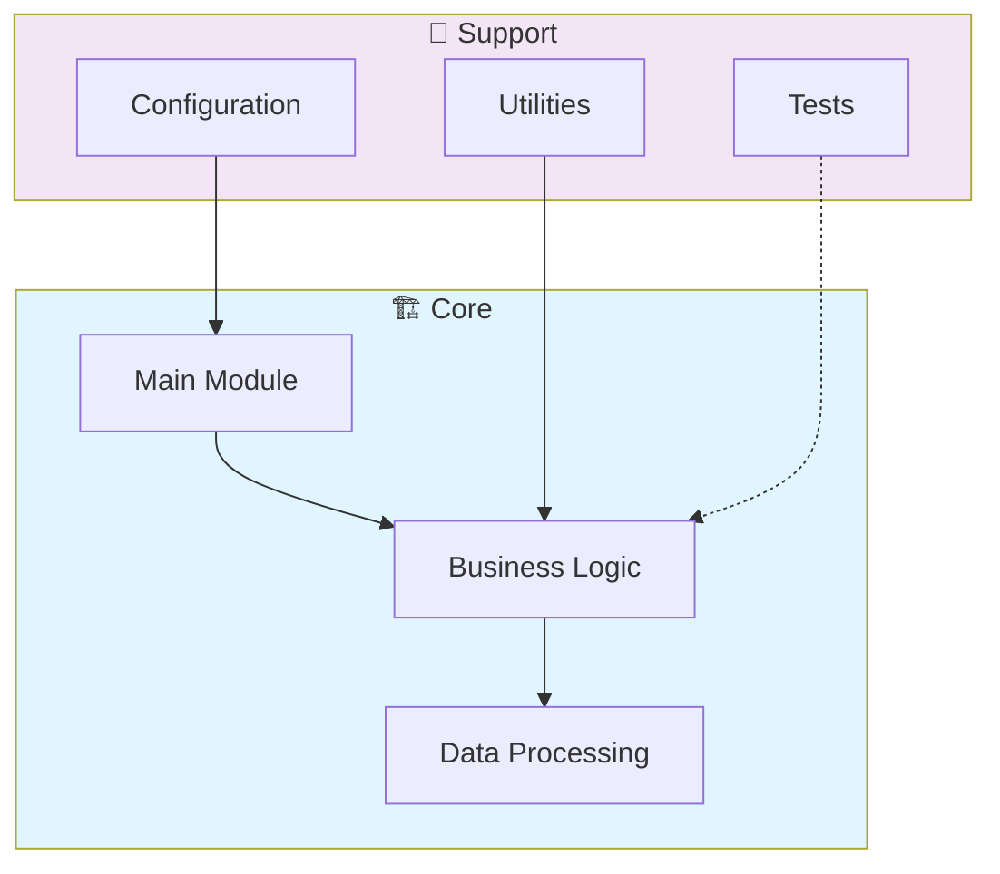
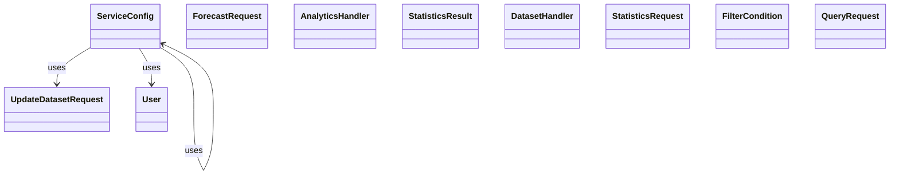

# 📊 Go Data Api Microservices

> Data Science project - go-data-api-microservices


[English](#english) | [Português](#português)

---

## English

### 🎯 Overview

**Go Data Api Microservices** is a production-grade Go application complemented by Shell that showcases modern software engineering practices including clean architecture, comprehensive testing, containerized deployment, and CI/CD readiness.

The codebase comprises **6,747 lines** of source code organized across **29 modules**, following industry best practices for maintainability, scalability, and code quality.

### ✨ Key Features

- **🔄 Data Pipeline**: Scalable ETL with parallel processing
- **✅ Data Validation**: Schema validation and quality checks
- **📊 Monitoring**: Pipeline health metrics and alerting
- **🔧 Configurability**: YAML/JSON-based pipeline configuration
- **🏗️ Object-Oriented**: 59 core classes with clean architecture

### 🏗️ Architecture


```mermaid
graph TB
    subgraph Core["🏗️ Core"]
        A[Main Module]
        B[Business Logic]
        C[Data Processing]
    end
    
    subgraph Support["🔧 Support"]
        D[Configuration]
        E[Utilities]
        F[Tests]
    end
    
    A --> B --> C
    D --> A
    E --> B
    F -.-> B
    
    style Core fill:#e1f5fe
    style Support fill:#f3e5f5
```


```mermaid
classDiagram
    class UpdateDatasetRequest
    class ServiceConfig
    class User
    class ForecastRequest
    class AnalyticsHandler
    class StatisticsResult
    class DatasetHandler
    class StatisticsRequest
    class FilterCondition
    class QueryRequest
    ServiceConfig --> UpdateDatasetRequest : uses
    ServiceConfig --> ServiceConfig : uses
    ServiceConfig --> User : uses
```

### 🚀 Quick Start

#### Prerequisites

- Go 1.22+

#### Installation

```bash
# Clone the repository
git clone https://github.com/galafis/go-data-api-microservices.git
cd go-data-api-microservices

# Download dependencies
go mod download
```

#### Running

```bash
# Run the application
go run ./...

# Or build and run
go build -o go-data-api-microservices ./...
./go-data-api-microservices
```

### 🐳 Docker

```bash
# Start all services
docker-compose up -d

# View logs
docker-compose logs -f

# Stop all services
docker-compose down

# Rebuild after changes
docker-compose up -d --build
```

### 🧪 Testing

```bash
# Run all tests
go test ./...

# Run with coverage
go test -cover ./...

# Run with verbose output
go test -v ./...
```

### 📁 Project Structure

```
go-data-api-microservices/
├── bin/
├── docs/          # Documentation
│   ├── README.en-us.md
│   └── README.pt-br.md
├── src/          # Source code
│   ├── cmd/
│   │   ├── analytics-service/
│   │   ├── api-gateway/
│   │   ├── auth-service/
│   │   └── data-service/
│   ├── internal/
│   │   ├── auth/
│   │   ├── config/        # Configuration
│   │   ├── database/
│   │   ├── handlers/
│   │   ├── middleware/
│   │   └── models/        # Data models
│   ├── pkg/
│   │   ├── logger/
│   │   ├── utils/         # Utilities
│   │   └── validator/
│   ├── Dockerfile
│   ├── LICENSE
│   ├── Makefile
│   └── docker-compose.yml
├── CONTRIBUTING.md
├── LICENSE
└── README.md
```

### 🔒 Security Considerations

| Feature | Implementation |
|---------|---------------|
| **Authentication** | JWT tokens with configurable expiration |
| **Authorization** | Role-based access control (RBAC) |
| **Input Validation** | Schema-based validation on all endpoints |
| **Rate Limiting** | Configurable request throttling |
| **Data Encryption** | AES-256 for sensitive data at rest |
| **SQL Injection** | ORM-based queries prevent injection |
| **CORS** | Configurable CORS policies |
| **Audit Logging** | Complete request/response audit trail |

> ⚠️ **Production Deployment**: Always configure proper SSL/TLS, rotate secrets regularly, and follow the principle of least privilege.

### 🛠️ Tech Stack

| Technology | Description | Role |
|------------|-------------|------|
| **Go** | Core Language | Primary |
| Shell | 6 files | Supporting |

### 🚀 Deployment

#### Cloud Deployment Options

The application is containerized and ready for deployment on:

| Platform | Service | Notes |
|----------|---------|-------|
| **AWS** | ECS, EKS, EC2 | Full container support |
| **Google Cloud** | Cloud Run, GKE | Serverless option available |
| **Azure** | Container Instances, AKS | Enterprise integration |
| **DigitalOcean** | App Platform, Droplets | Cost-effective option |

```bash
# Production build
docker build -t go-data-api-microservices:latest .

# Tag for registry
docker tag go-data-api-microservices:latest registry.example.com/go-data-api-microservices:latest

# Push to registry
docker push registry.example.com/go-data-api-microservices:latest
```

### 🤝 Contributing

Contributions are welcome! Please feel free to submit a Pull Request. For major changes, please open an issue first to discuss what you would like to change.

1. Fork the project
2. Create your feature branch (`git checkout -b feature/AmazingFeature`)
3. Commit your changes (`git commit -m 'Add some AmazingFeature'`)
4. Push to the branch (`git push origin feature/AmazingFeature`)
5. Open a Pull Request

### 📄 License

This project is licensed under the MIT License - see the [LICENSE](LICENSE) file for details.

### 👤 Author

**Gabriel Demetrios Lafis**
- GitHub: [@galafis](https://github.com/galafis)
- LinkedIn: [Gabriel Demetrios Lafis](https://linkedin.com/in/gabriel-demetrios-lafis)

---

## Português

### 🎯 Visão Geral

**Go Data Api Microservices** é uma aplicação Go de nível profissional, complementada por Shell que demonstra práticas modernas de engenharia de software, incluindo arquitetura limpa, testes abrangentes, implantação containerizada e prontidão para CI/CD.

A base de código compreende **6,747 linhas** de código-fonte organizadas em **29 módulos**, seguindo as melhores práticas do setor para manutenibilidade, escalabilidade e qualidade de código.

### ✨ Funcionalidades Principais

- **🔄 Data Pipeline**: Scalable ETL with parallel processing
- **✅ Data Validation**: Schema validation and quality checks
- **📊 Monitoring**: Pipeline health metrics and alerting
- **🔧 Configurability**: YAML/JSON-based pipeline configuration
- **🏗️ Object-Oriented**: 59 core classes with clean architecture

### 🏗️ Arquitetura


```mermaid
graph TB
    subgraph Core["🏗️ Core"]
        A[Main Module]
        B[Business Logic]
        C[Data Processing]
    end
    
    subgraph Support["🔧 Support"]
        D[Configuration]
        E[Utilities]
        F[Tests]
    end
    
    A --> B --> C
    D --> A
    E --> B
    F -.-> B
    
    style Core fill:#e1f5fe
    style Support fill:#f3e5f5
```

### 🚀 Início Rápido

#### Prerequisites

- Go 1.22+

#### Installation

```bash
# Clone the repository
git clone https://github.com/galafis/go-data-api-microservices.git
cd go-data-api-microservices

# Download dependencies
go mod download
```

#### Running

```bash
# Run the application
go run ./...

# Or build and run
go build -o go-data-api-microservices ./...
./go-data-api-microservices
```

### 🐳 Docker

```bash
# Start all services
docker-compose up -d

# View logs
docker-compose logs -f

# Stop all services
docker-compose down

# Rebuild after changes
docker-compose up -d --build
```

### 🧪 Testing

```bash
# Run all tests
go test ./...

# Run with coverage
go test -cover ./...

# Run with verbose output
go test -v ./...
```

### 📁 Estrutura do Projeto

```
go-data-api-microservices/
├── bin/
├── docs/          # Documentation
│   ├── README.en-us.md
│   └── README.pt-br.md
├── src/          # Source code
│   ├── cmd/
│   │   ├── analytics-service/
│   │   ├── api-gateway/
│   │   ├── auth-service/
│   │   └── data-service/
│   ├── internal/
│   │   ├── auth/
│   │   ├── config/        # Configuration
│   │   ├── database/
│   │   ├── handlers/
│   │   ├── middleware/
│   │   └── models/        # Data models
│   ├── pkg/
│   │   ├── logger/
│   │   ├── utils/         # Utilities
│   │   └── validator/
│   ├── Dockerfile
│   ├── LICENSE
│   ├── Makefile
│   └── docker-compose.yml
├── CONTRIBUTING.md
├── LICENSE
└── README.md
```

### 🔒 Security Considerations

| Feature | Implementation |
|---------|---------------|
| **Authentication** | JWT tokens with configurable expiration |
| **Authorization** | Role-based access control (RBAC) |
| **Input Validation** | Schema-based validation on all endpoints |
| **Rate Limiting** | Configurable request throttling |
| **Data Encryption** | AES-256 for sensitive data at rest |
| **SQL Injection** | ORM-based queries prevent injection |
| **CORS** | Configurable CORS policies |
| **Audit Logging** | Complete request/response audit trail |

> ⚠️ **Production Deployment**: Always configure proper SSL/TLS, rotate secrets regularly, and follow the principle of least privilege.

### 🛠️ Stack Tecnológica

| Tecnologia | Descrição | Papel |
|------------|-----------|-------|
| **Go** | Core Language | Primary |
| Shell | 6 files | Supporting |

### 🚀 Deployment

#### Cloud Deployment Options

The application is containerized and ready for deployment on:

| Platform | Service | Notes |
|----------|---------|-------|
| **AWS** | ECS, EKS, EC2 | Full container support |
| **Google Cloud** | Cloud Run, GKE | Serverless option available |
| **Azure** | Container Instances, AKS | Enterprise integration |
| **DigitalOcean** | App Platform, Droplets | Cost-effective option |

```bash
# Production build
docker build -t go-data-api-microservices:latest .

# Tag for registry
docker tag go-data-api-microservices:latest registry.example.com/go-data-api-microservices:latest

# Push to registry
docker push registry.example.com/go-data-api-microservices:latest
```

### 🤝 Contribuindo

Contribuições são bem-vindas! Sinta-se à vontade para enviar um Pull Request.

### 📄 Licença

Este projeto está licenciado sob a Licença MIT - veja o arquivo [LICENSE](LICENSE) para detalhes.

### 👤 Autor

**Gabriel Demetrios Lafis**
- GitHub: [@galafis](https://github.com/galafis)
- LinkedIn: [Gabriel Demetrios Lafis](https://linkedin.com/in/gabriel-demetrios-lafis)
